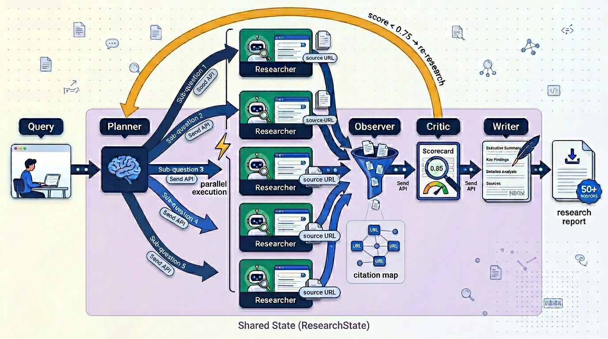

# 🔬 Deep Research Agent




A production-grade multi-agent research system built with LangGraph, FastAPI, and Streamlit. Given a research query, the system autonomously breaks it into sub-questions, researches each one in parallel, evaluates quality, loops for more research if needed, and generates a structured markdown report with proper citations.

Built entirely on free-tier infrastructure — Groq (LLaMA 3.3), DuckDuckGo, SQLite.

---

## Architecture

```
Query
  ↓
┌─────────────────────────────────────────────────────────┐
│  PLANNER                                                │
│  Breaks query into N sub-questions (3 / 5 / 8)         │
│  On re-iteration: targets specific gaps from Critic     │
└──────────────────────┬──────────────────────────────────┘
                       ↓  Send API (dynamic parallelism)
        ┌──────────────┼──────────────┐
        ↓              ↓              ↓
  RESEARCHER 1   RESEARCHER 2   RESEARCHER N   (parallel)
  LLM generates  LLM generates  LLM generates
  search query   search query   search query
  → DuckDuckGo   → DuckDuckGo   → DuckDuckGo
  → LLM summary  → LLM summary  → LLM summary
        └──────────────┼──────────────┘
                       ↓  operator.add merges all findings
┌─────────────────────────────────────────────────────────┐
│  OBSERVER                                               │
│  Merges N findings into one unified context block       │
│  Builds citation map: { sq_id → [url1, url2, ...] }    │
└──────────────────────┬──────────────────────────────────┘
                       ↓
┌─────────────────────────────────────────────────────────┐
│  CRITIC                                                 │
│  Scores research quality 0.0 → 1.0                      │
│  Identifies gaps and contradictions                     │
│  score < 0.75 AND iteration < max → loop back           │
└──────────┬───────────────────────────┬──────────────────┘
           ↓ "loop"                    ↓ "write"
        PLANNER                     WRITER
        (gap-targeted               Structured markdown
         re-research)               report with citations
                                       ↓
                                      END
```

### Key patterns

| Pattern | Where used | What it enables |
|---|---|---|
| Send API | Planner → Researchers | Dynamic N parallel agents at runtime |
| `Annotated[List, operator.add]` | `findings` field in state | Parallel writes merge instead of overwrite |
| Conditional loop | Critic → Planner | Automatic re-research when quality is low |
| `interrupt_before` | Before Writer node | Human approval before report generation |
| Background tasks | FastAPI | API returns instantly, research runs async |
| SQLite checkpointer | All nodes | State persists across server restarts |

---

## Project structure

```
deep-research-agent/
├── core/
│   ├── state.py          # ResearchState TypedDict + initial_state()
│   └── checkpointer.py   # SQLite/MemorySaver setup + thread_id helpers
├── agents/
│   ├── planner.py        # Sub-question generation, gap-targeted re-planning
│   ├── researcher.py     # Per-sub-question web search + summarisation
│   ├── observer.py       # Findings merger + citation map builder
│   ├── critic.py         # Quality scoring + loop routing function
│   ├── writer.py         # Markdown report generation with citations
│   └── graph.py          # Full pipeline assembly + run_research()
├── api/
│   └── main.py           # FastAPI: POST /research, GET /research/{id}, approve
└── frontend/
    └── app.py            # Streamlit UI with live polling + approval flow
```

---

## Quickstart

### 1. Clone and install

```bash
git clone https://github.com/YOUR_USERNAME/deep-research-agent.git
cd deep-research-agent
python3 -m venv venv
source venv/bin/activate
pip install -r requirements.txt
```

### 2. Set up environment variables

```bash
cp .env.example .env
```

Edit `.env`:

```
GROQ_API_KEY=your-groq-key-here
LANGSMITH_API_KEY=your-langsmith-key-here   # optional but recommended
LANGSMITH_TRACING=true
LANGSMITH_PROJECT=deep-research-agent
```

Get a free Groq key at [console.groq.com](https://console.groq.com).
Get a free LangSmith key at [smith.langchain.com](https://smith.langchain.com).

### 3. Run from the command line

```bash
# Quick research run (3 sub-questions)
python agents/graph.py "How is AI changing healthcare diagnostics?" --depth quick

# Standard run (5 sub-questions)
python agents/graph.py "What are the geopolitical implications of semiconductor supply chains?"

# With human review pause before writing
python agents/graph.py "Explain the current state of fusion energy research" --review
```

### 4. Run the full stack

Terminal 1 — FastAPI:
```bash
uvicorn api.main:app --reload --port 8000
```

Terminal 2 — Streamlit:
```bash
streamlit run frontend/app.py
```

Open [http://localhost:8501](http://localhost:8501) in your browser.

---

## API reference

| Method | Endpoint | Description |
|---|---|---|
| `POST` | `/research` | Start a research run |
| `GET` | `/research/{job_id}` | Poll for status and results |
| `POST` | `/research/{job_id}/approve` | Approve or reject a paused run |
| `GET` | `/research` | List all recent runs |
| `GET` | `/health` | Health check |

### Start a research run

```bash
curl -X POST http://localhost:8000/research \
     -H "Content-Type: application/json" \
     -d '{"query": "How is AI changing healthcare?", "depth": "quick"}'
```

Response:
```json
{
  "job_id": "6e5a96fd",
  "thread_id": "research-54c325b5-984585",
  "status": "queued",
  "message": "Research started. Poll GET /research/6e5a96fd for results."
}
```

### Poll for results

```bash
curl http://localhost:8000/research/6e5a96fd
```

Response when complete:
```json
{
  "status": "complete",
  "quality_score": 0.85,
  "total_sources": 15,
  "iterations": 1,
  "final_report": "## Executive Summary\n...",
  "report_sections": ["Executive Summary", "Key Findings", "Detailed Analysis", "Limitations & Gaps", "Sources"]
}
```

### Human review flow

```bash
# Start with human_review=true
curl -X POST http://localhost:8000/research \
     -d '{"query": "...", "human_review": true}'

# Poll until status = "awaiting_approval", then approve
curl -X POST http://localhost:8000/research/{job_id}/approve \
     -d '{"approved": true}'
```

---

## How it differs from a basic RAG system

| | Basic RAG | This system |
|---|---|---|
| Query handling | Single vector search | Decomposed into N sub-questions |
| Parallelism | Sequential | N agents run simultaneously |
| Quality control | None | Critic scores and loops if needed |
| Human oversight | None | interrupt_before approval flow |
| Sources per run | 3-5 | 10-60+ across all researchers |
| State persistence | None | SQLite checkpointer |
| API | None | FastAPI with background tasks |
| Frontend | None | Streamlit with live polling |

---

## Tech stack

| Component | Technology | Why |
|---|---|---|
| Agent framework | LangGraph 1.x | Native parallelism, loop control, human-in-the-loop |
| LLM | Groq LLaMA 3.3 70B | Free tier, fast inference |
| Web search | DuckDuckGo (direct Python call) | Free, no API key, avoids tool-calling flakiness |
| State persistence | SQLite / MemorySaver | Zero-config for development |
| API | FastAPI + uvicorn | Async, background tasks, auto-generated docs |
| Frontend | Streamlit | Rapid UI, live polling, markdown rendering |
| Tracing | LangSmith | Node-level observability, cost tracking |

---

## Upgrading for production

```python
# core/checkpointer.py
# Swap MemorySaver for PostgresSaver

from langgraph.checkpoint.postgres import PostgresSaver

def get_checkpointer():
    return PostgresSaver.from_conn_string(os.getenv("DATABASE_URL"))
```

```bash
# Deploy API
uvicorn api.main:app --host 0.0.0.0 --port 8000 --workers 4

# Or with Docker
docker compose up
```

---

## Example output

**Query:** What is the impact of LLMs on software engineering jobs?
**Depth:** standard | **Iterations:** 1 | **Sources:** 14 | **Quality:** 0.85

> Large language models are transforming software engineering by automating code generation, testing, and debugging. GitHub Copilot completes 40% of code for some developers. Studies show 55% productivity gains when using LLM-powered tools...

[Full report with 14 cited sources, 5 sections, 5000+ words]

---

## License

MIT